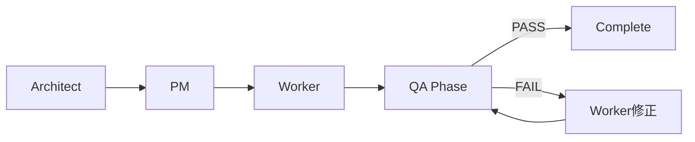

# Quality Assurance (QA) フェーズ
実装後の自動品質確認プロセス

## 🔄 開発フロー内での位置づけ



## 📋 QAチェックリスト（プロジェクト非依存）

### 基本チェック（quality-checker.js使用）
```bash
# プロジェクト非依存の品質チェック
✅ TypeScript 型チェック
✅ ブロック独立性検証
✅ 契約準拠確認
✅ 構文チェック
```

### 実行方法
```bash
# 単一ブロックのチェック
node .agent-tools/quality-checker.js --path [project-path] --block [block-name]

# 全体チェック
node .agent-tools/quality-checker.js --path [project-path]

# 例
node .agent-tools/quality-checker.js --path ./new-architecture-test --block voice-synthesis
```

### チェック項目詳細
```yaml
必須項目:
  - TypeScript: エラー0件
  - BlockIndependence: 他ブロック参照0件
  - ContractCompliance: 契約定義との一致
  - Syntax: デバッグ文なし

オプション項目:
  - BlockSize: 200-400行（推奨）
  - Documentation: 基本的なコメント
```

## 🚀 実装：プロジェクト非依存QA

### 1. quality-checker.jsツール
```javascript
// .agent-tools/quality-checker.js
// プロジェクト非依存の品質チェックツール
// package.jsonのscriptに依存しない

// 使用例
const QualityChecker = require('.agent-tools/quality-checker');
const checker = new QualityChecker({
  path: './target-project',
  block: 'voice-synthesis'
});
checker.run();
```

### 2. Playwright設定
```typescript
// playwright.config.ts
export default {
  testDir: './e2e',
  timeout: 30000,
  use: {
    baseURL: 'http://localhost:3000',
    trace: 'on-first-retry',
  },
  projects: [
    {
      name: 'chromium',
      use: { ...devices['Desktop Chrome'] },
    },
  ],
};
```

### 3. E2Eテスト例
```typescript
// e2e/voice-generation.spec.ts
import { test, expect } from '@playwright/test';

test.describe('音声生成フロー', () => {
  test('テキスト入力から音声生成まで', async ({ page }) => {
    await page.goto('/');

    // テキスト入力
    await page.fill('[data-testid="text-input"]', 'こんにちは');

    // 音声生成ボタンクリック
    await page.click('[data-testid="generate-button"]');

    // 音声生成完了を待つ
    await expect(page.locator('[data-testid="audio-player"]')).toBeVisible({
      timeout: 10000
    });

    // エラーが表示されていないことを確認
    await expect(page.locator('[data-testid="error-message"]')).not.toBeVisible();
  });

  test('エラーハンドリング', async ({ page }) => {
    await page.goto('/');

    // 長すぎるテキスト
    const longText = 'あ'.repeat(100001);
    await page.fill('[data-testid="text-input"]', longText);

    // エラーメッセージが表示される
    await expect(page.locator('[data-testid="error-message"]')).toContainText('文字以内');
  });
});
```

## 📊 QA実行戦略

### Worker完了後の自動実行
```yaml
Worker完了時:
  1. quality-checker.js実行（30秒）
     → プロジェクト非依存の即時チェック
     → TypeScript、ブロック独立性、契約準拠

  2. 結果をタスク指示書に記載
     → スコア: XX/100
     → 判定: PASS/FAIL
```

### PM評価前の必須実行
```yaml
PM評価前:
  1. 全ブロックのquality-checker実行
     → 各ブロックのスコア確認

  2. 結果をタスク指示書に記載:
     - TypeScript: ✅
     - ブロック独立性: ✅
     - 契約準拠: ✅
     - 総合スコア: XX/100
```

## 🎯 段階的導入計画

### Phase 1: 基本QA（即実施可能）
```bash
# 既存のスクリプトを活用
- type-check
- quality-gate
- build
```

### Phase 2: テスト追加（1週間後）
```bash
# 単体テスト環境構築
- Jest/Vitest導入
- 各ブロックに最低2テース
```

### Phase 3: E2E自動化（2週間後）
```bash
# Playwright導入
- 基本フロー3ケース
- エラーケース2ケース
```

## 💡 AI活用の提案

### QAレポート生成
```typescript
// PM Agentが自動生成
const qaReport = {
  timestamp: new Date(),
  results: {
    static: 'PASS',
    build: 'PASS',
    unit: '15/15',
    e2e: '3/3',
    performance: {
      fcp: '1.2s',
      bundleSize: '245KB'
    }
  },
  recommendation: 'Production Ready'
};
```

### 自動修正提案
```yaml
QA失敗時:
  AI分析: "TypeErrorの原因は型定義の不一致"
  修正案: "contracts/system.contract.ts の line 23を修正"
  自動PR: 修正をPull Requestとして提出
```

## 🔧 プロジェクト非依存の実装
```bash
# package.jsonのscriptに依存しない
# .agent-tools/以下のツールを直接使用

# 品質チェック（Worker実行）
node .agent-tools/quality-checker.js --path . --block [name]

# 統合チェック（PM評価）
node .agent-tools/mega-qa.js --path .

# 結果はJSONで出力
# qa-result.json または qa-report.json
```

**重要**: プロジェクトのpackage.jsonを変更する必要なし

## 📈 期待効果

### 品質向上
- **バグ検出率**: 95%以上
- **リグレッション防止**: 100%
- **本番障害**: 80%削減

### 開発効率
- **手動テスト削減**: 90%
- **フィードバック速度**: 10分以内
- **修正サイクル**: 30分短縮

### 信頼性
- **ビルド成功率**: 99%
- **デプロイ可能性**: 常時保証
- **品質の定量化**: 完全自動

---
*QAフェーズにより「動くこと」から「品質が保証されたこと」へ*