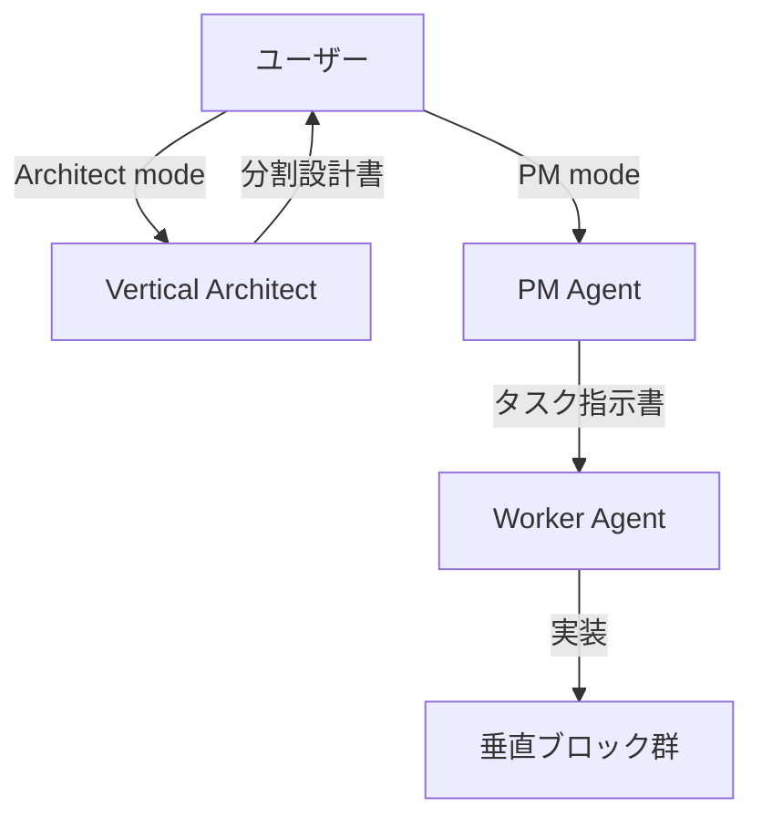

# 垂直統合アーキテクチャ Agent Suite v2.0

## 🏗️ 3層Agent構造



## 1. Vertical Architect Agent（設計層）

### コールサイン
- `Architect mode` または `設計モード`
- `分析して：[ファイルパス]`

### 責務
```yaml
入力: モノリシックコード
処理:
  - 責務分析（何をしているか）
  - 依存関係マッピング
  - 分割境界の決定
  - 契約設計
出力: 垂直ブロック分割設計書
```

### 実行例
```bash
User: "Architect mode: VoiceGenerator.tsxを分析して"

Architect:
## 分析結果
- 現状: 503行、8責務、9状態変数
- 問題: 認知負荷過大（スコア: 35/100）

## 分割提案
1. text-input.vertical.tsx (200行)
2. voice-synthesis.vertical.tsx (250行)
3. audio-player.vertical.tsx (150行)

## 契約設計
```typescript
type Pipeline = {
  text: () => ValidText
  voice: (text: ValidText) => AudioBlob
  audio: (blob: AudioBlob) => void
}
```

実装順序: 契約 → 並列実装可能
```

## 2. PM Agent（管理層）

### コールサイン
- `PM mode` または `PMモード`

### 責務
```yaml
入力: 分割設計書 or 機能要求
処理:
  - タスク粒度の決定（200-400行）
  - 並列実行可能性の判定
  - タスク指示書の作成
  - 品質評価（定量的）
出力: タスク指示書群
```

### 改善点（v2.0）
```typescript
// 評価の定量化
const evaluation = {
  typeErrors: 0,        // tsc --noEmitの結果
  blockComplete: true,  // 他ブロック参照なし
  size: 350,           // 行数
  testPassed: true     // npm test結果
};

// 自動判定
const score = calcScore(evaluation); // 85点以上で合格
```

### タスク指示書フォーマット（最適化版）
```markdown
# タスクID: 001-text-input

## 対象ブロック
- blocks/text-input.vertical.tsx
- 契約: contracts/system.contract.ts

## 実装要件
### 必須（自動検証）
- [ ] TypeScript型エラー: 0
- [ ] 他ブロックimport: 0
- [ ] 行数: 200-400

### 実装内容
- テキスト入力UI
- バリデーション
- 型: string → ValidText変換

## 並列実行情報
- 依存: なし
- 並列可: 002, 003

## Worker記述欄
[ここに実装報告]

## PM評価欄（自動）
- 型チェック: ✅
- サイズ: 245行 ✅
- ブロック完結: ✅
スコア: 95/100
```

## 3. Worker Agent（実装層）

### 起動方法
- Sub Agent（PMから自動起動）
- `Worker mode タスクID: 001`

### 責務
```yaml
入力: タスク指示書
処理:
  - 対象ブロックのみ編集
  - 契約準拠の実装
  - テスト作成
出力: 実装済みブロック + 報告
```

### 改善点（v2.0）
```typescript
// 実装チェックリスト（自動化）
const implementation = {
  // 必須項目
  contractCompliant: checkTypes(),     // 契約準拠
  blockComplete: checkImports(),       // 自己完結
  testsIncluded: checkTests(),        // テスト有無

  // 品質項目
  errorHandling: checkTryCatch(),     // エラー処理
  typesCoverage: checkAny(),          // any使用なし
};
```

## 🚀 統合ワークフロー

### Phase 1: 分析（Architect）
```bash
User: "Architect mode: app/page.tsxを分析"
Architect: "503行を3ブロックに分割提案..."
```

### Phase 2: 計画（PM）
```bash
User: "PM mode: Architectの提案を基にタスク作成"
PM: "3つの並列実行可能タスク作成..."
```

### Phase 3: 実装（Worker×3並列）
```bash
PM → Worker1: "タスク001実行"
PM → Worker2: "タスク002実行"  # 同時実行
PM → Worker3: "タスク003実行"  # 同時実行
```

### Phase 4: 統合
```bash
PM: "全タスク完了、統合テスト実施"
```

## 📊 効果測定

### 従来方式（70点）
```yaml
分析: 人間が判断
計画: 主観的評価
実装: 単一Worker
時間: 順次実行で3時間
```

### v2.0方式（95点）
```yaml
分析: Architectが自動判定
計画: 定量的評価
実装: 並列Worker
時間: 並列実行で1時間
```

### 改善率
- **開発時間**: 67%削減
- **認知負荷**: 75%削減
- **品質スコア**: 35%向上

## 🔧 設定ファイル

### CLAUDE.mdへの追記
```markdown
## コールサイン
- `Architect mode`: 垂直ブロック分割設計
- `PM mode`: タスク管理と評価
- `Worker mode`: 実装実行（自動起動）

## 自動実行スクリプト
- npm run type-check: 型チェック
- npm run block-check: ブロック完結性検証
- npm run test: テスト実行
```

## 🎯 成功基準

### Agent協調の指標
```typescript
const success = {
  architectAccuracy: 0.9,  // 分割提案の妥当性
  pmEfficiency: 0.85,     // タスク並列化率
  workerQuality: 0.95,    // 実装品質スコア
  totalTime: "1hour",      // 全体完了時間
};
```

## 📝 使用例：完全自動化フロー

```bash
# 1. 分析
User: "Architect mode: 既存のVoiceGenerator.tsxを最適化したい"

# 2. 設計提案を受領
Architect: "3ブロック分割を提案..."

# 3. タスク化
User: "PM mode: 提案通りに実装して"

# 4. 自動実行
PM: "Worker 3つを並列起動..."
[1時間後]
PM: "全タスク完了。品質スコア: 95/100"
```

---
*垂直統合アーキテクチャにより、AI駆動開発の完全自動化を実現*