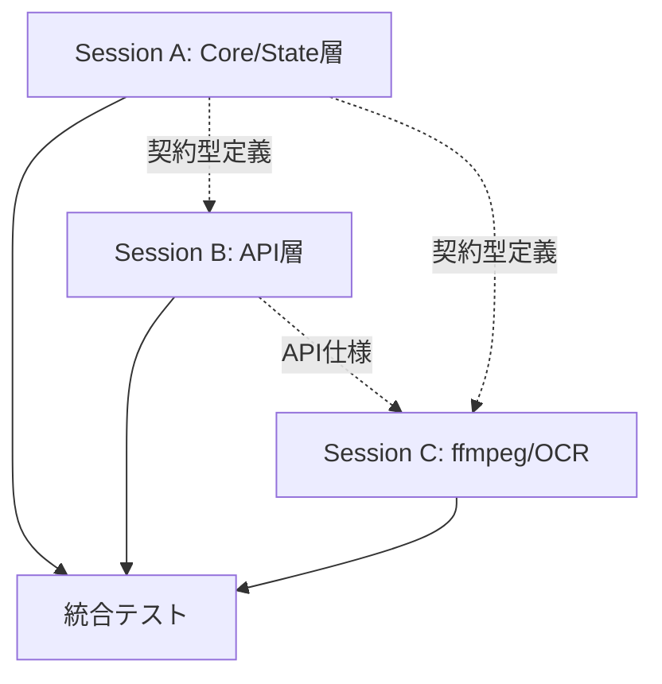

# 🚀 FCIS+SMAC VOICEVOX並列実行計画

## 概要
既存のFCIS+SMACアーキテクチャを活かしながら、仕様書（TSD-107）の要件を満たすための並列実装計画。

## アーキテクチャ方針
- **維持**: FCIS+SMAC 3層構造（Core/State/Shell）
- **破壊的変更**: 許可（既存機能の大幅拡張）
- **UI実装**: 後回し（バックエンド機能を優先）

## 主要変更点
1. **文字数制限**: 1,000文字 → 30,000文字
2. **話者**: ずんだもんのみ → 四国めたん追加
3. **音声形式**: WAV → MP3（ffmpeg使用）
4. **OCR**: 未実装 → Tesseract.js統合
5. **チャンク処理**: 未実装 → 500文字分割・WAV結合

## 並列セッション構成

### 📦 Session A: Core層とState層の拡張
**ファイル**: `/parallel-sessions/session-a-core-state.md`

**責務**:
- 純粋関数によるビジネスロジック実装
- XState状態機械の拡張
- 30,000文字対応バリデーション
- 500文字チャンク分割アルゴリズム
- OCRテキスト正規化

**主要ファイル**:
- `/core/voicevox.core.ts`
- `/state/voicevox.machine.ts`
- `/contracts/extended-voice-synthesis.contract.ts`

---

### 🔌 Session B: API層とVOICEVOX統合
**ファイル**: `/parallel-sessions/session-b-api-integration.md`

**責務**:
- APIエンドポイントの拡張
- VOICEVOX接続クライアント実装
- チャンク単位の音声合成処理
- エラーハンドリングとリトライロジック

**主要ファイル**:
- `/app/api/synthesize/route.ts`
- `/app/api/synthesize-chunk/route.ts`
- `/lib/voicevox-client.ts`

---

### 🎵 Session C: ffmpeg統合とOCRバックエンド
**ファイル**: `/parallel-sessions/session-c-ffmpeg-ocr.md`

**責務**:
- WAVファイル結合処理
- MP3変換処理（ffmpeg）
- OCRサーバーサイド実装
- Docker環境整備

**主要ファイル**:
- `/lib/audio-processor.ts`
- `/app/api/ocr/route.ts`
- `/Dockerfile`

## 共通インターフェース定義

```typescript
// /contracts/types.ts
export type SpeakerId = 2 | 3; // 四国めたん | ずんだもん

export interface TextChunk {
  index: number;
  text: string;
  size: number;
}

export interface OCRResult {
  text: string;
  normalizedText: string;
  confidence: number;
}

export interface AudioChunk {
  index: number;
  text: string;
  wavData: ArrayBuffer;
}

export interface ExtendedProgress {
  phase: 'idle' | 'ocr' | 'chunking' | 'synthesis' | 'merging' | 'converting' | 'completed';
  current: number;
  total: number;
  percentage: number;
}
```

## 実装順序と依存関係



## 並列実行方法

### 各Claude Codeセッションで実行:

**Session A用コマンド**:
```bash
cd /app/fcis-smac-app
cat parallel-sessions/session-a-core-state.md
# 指示書に従って実装
```

**Session B用コマンド**:
```bash
cd /app/fcis-smac-app
cat parallel-sessions/session-b-api-integration.md
# 指示書に従って実装
```

**Session C用コマンド**:
```bash
cd /app/fcis-smac-app
cat parallel-sessions/session-c-ffmpeg-ocr.md
# 指示書に従って実装
```

## 成功基準

### 機能要件
- ✅ 30,000文字のテキスト処理が可能
- ✅ ずんだもん・四国めたんの両方で音声合成
- ✅ MP3形式で出力
- ✅ OCR機能が動作
- ✅ 500文字チャンク処理とWAV結合

### 非機能要件
- ✅ FCIS+SMACアーキテクチャ維持
- ✅ Core層の純粋関数性保持
- ✅ 適切なエラーハンドリング
- ✅ Docker環境での動作

## 統合後の検証

1. **単体テスト**: 各層のテスト実行
```bash
npm run test
```

2. **統合テスト**: エンドツーエンドテスト
```bash
npm run test:e2e
```

3. **Docker動作確認**:
```bash
docker compose up --build
```

## 注意事項

⚠️ **重要**:
- 各セッションは独立して実装可能ですが、契約型定義（contracts/types.ts）は共通
- UI実装は後回しのため、APIとバックエンド機能を優先
- ffmpeg依存のため、Dockerfileの更新を忘れずに

---

*このプランに基づいて3つのClaude Codeセッションで並列実装を開始してください。*